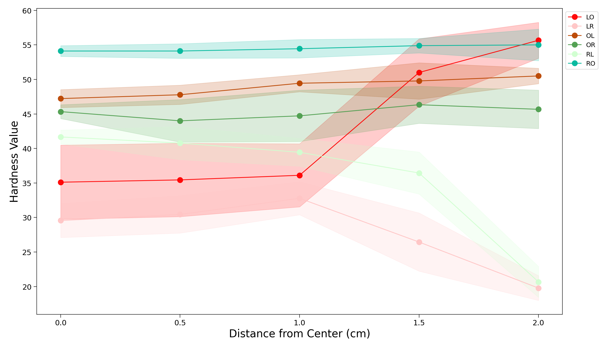

# PDMS:CB heating condition hardness testing
This repository contains the code for a PDMS:CB heating condition hardness testing experiment.  Given heating conditions of (1) lasing, (2) oven, and (3) room temperature, each permutation was prepared in triplicate and is shown below.  The various plots are simply to declutter the data, but the final plot shows all data on the same axes.

## 1 step

## 2 steps

## 3 steps

## L__

## O__

## R__

## TOTAL

